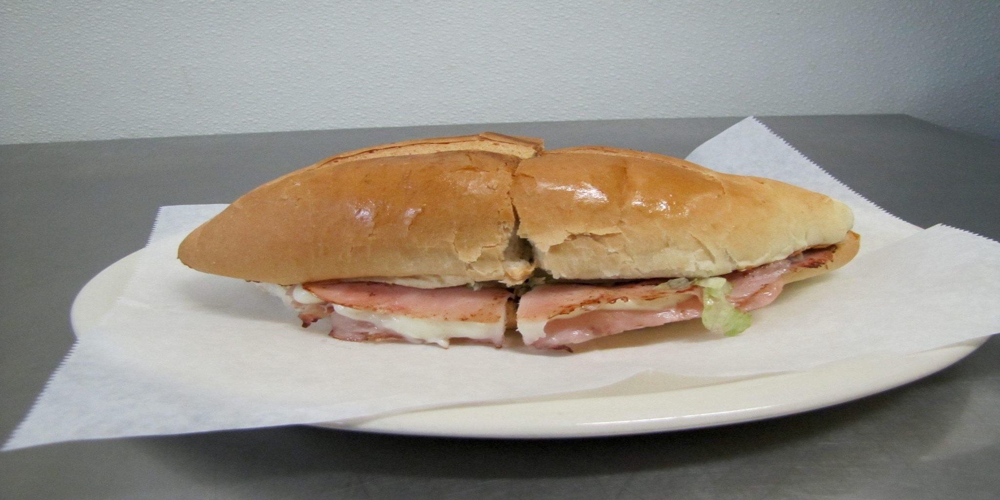
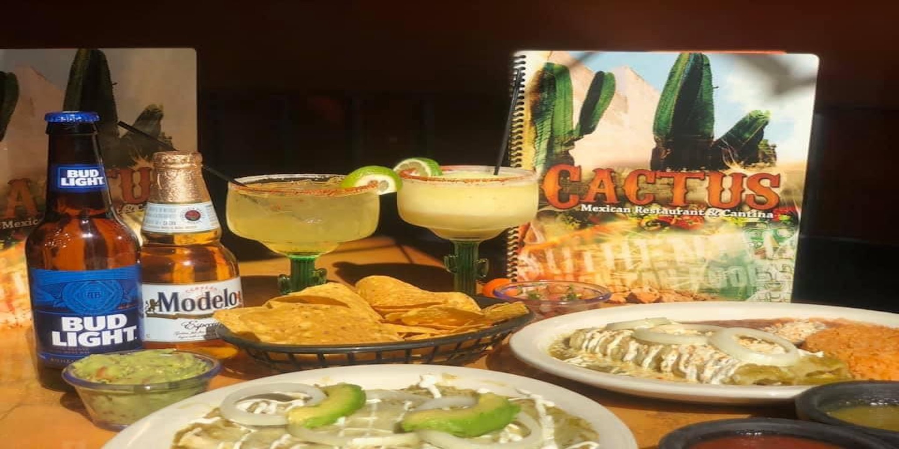
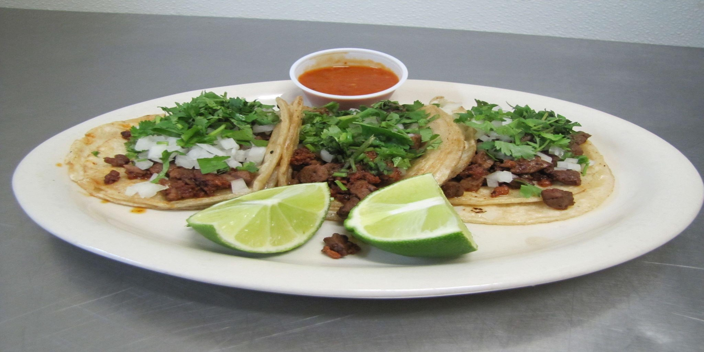

# CactusRestaurant

                        
                        
                        
                        
                        

                        <button class="button-display-left" style="height:40px;width:40px;" onclick="plusDivs(-1)">&#10094;</button>
                        <button class="button-display-right" style="height:40px;width:40px;" onclick="plusDivs(1)">&#10095;</button>
                    

        <!-- JS rotating slideshow function -->
        

        <!-- JS function for next/previous image selectors on home page-->
        
